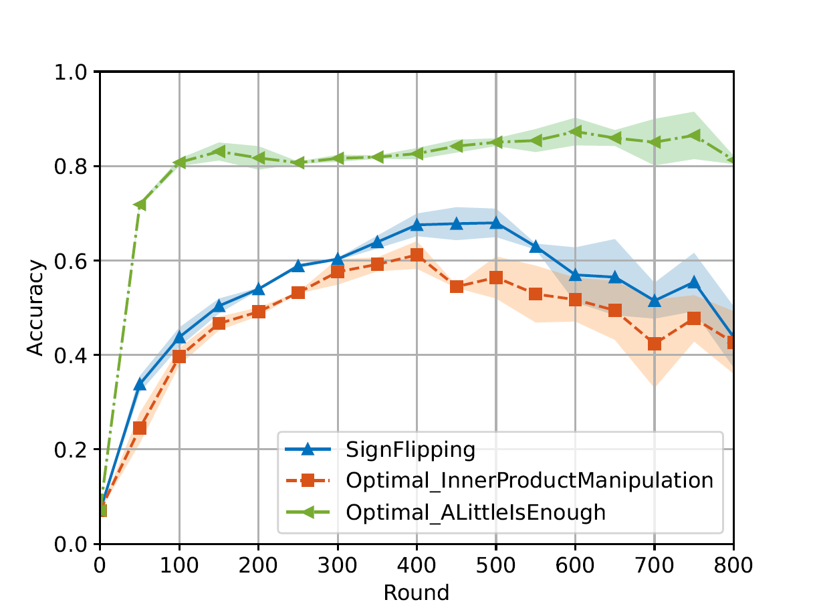
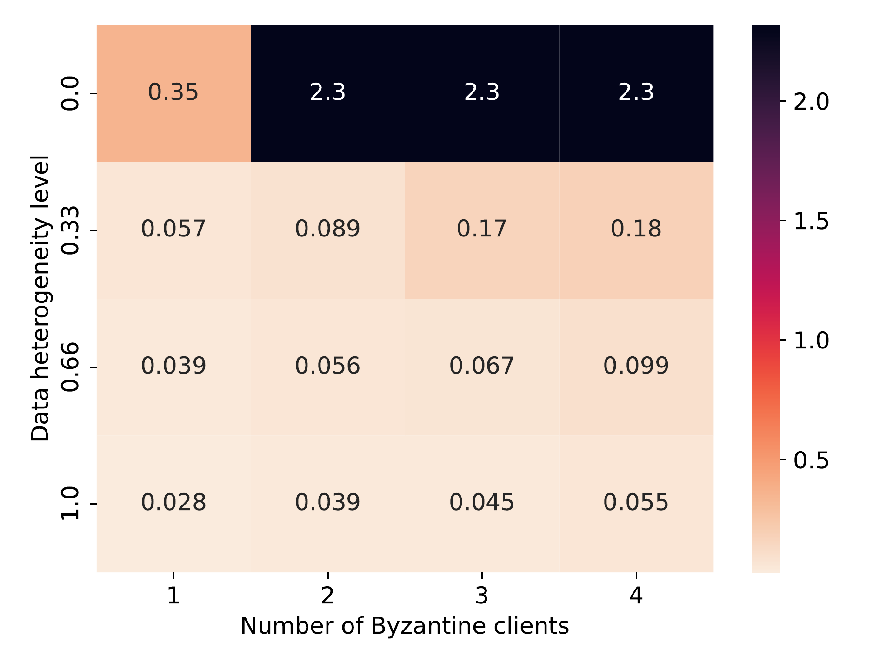
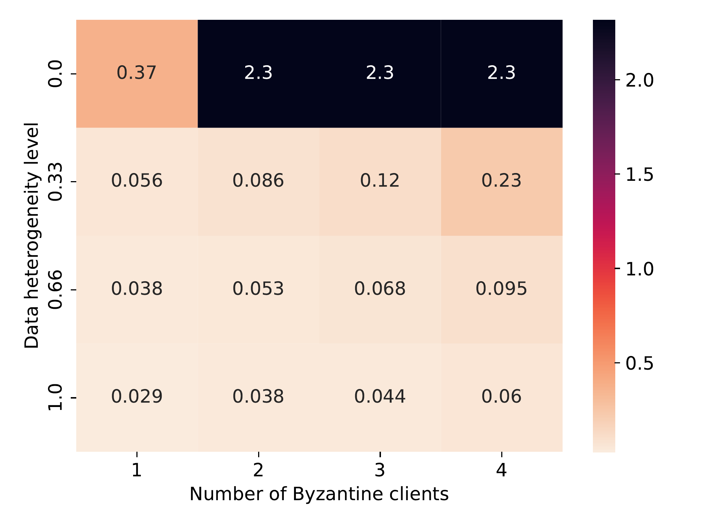
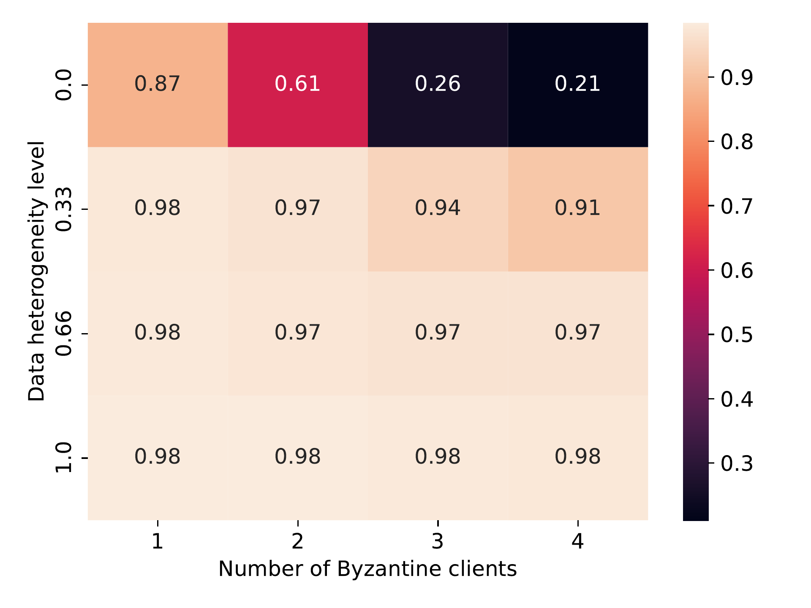
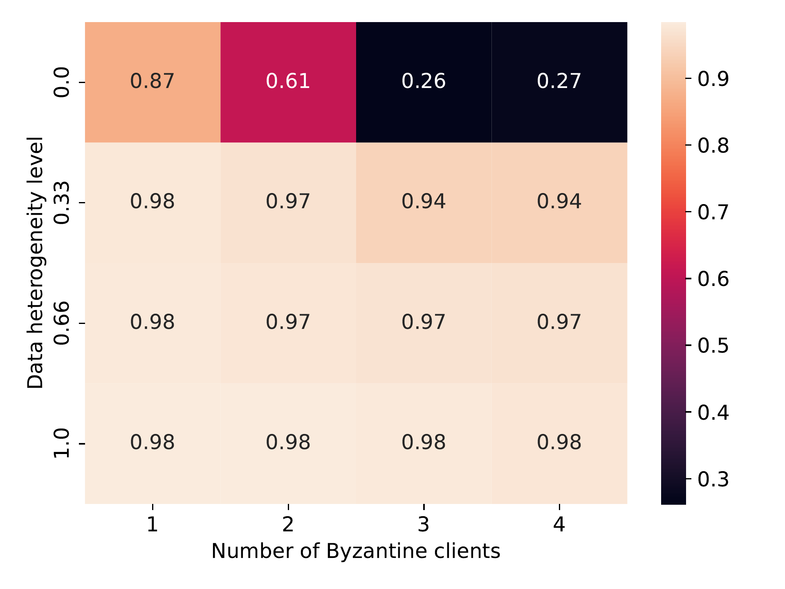

# FL Benchmark

The **FL Benchmark** in ByzFL is a **comprehensive testing framework** for evaluating federated learning aggregation methods under adversarial conditions. It automates large-scale experiments, allowing users to test various **aggregators, attacks, and data heterogeneity levels** through a single **configurable JSON file**.

This benchmark extends the Federated Learning Framework by enabling **systematic evaluation** rather than manual experiment setup.

---

## Key Features

- **Fully Configurable via JSON**  
  Define federated learning scenarios (e.g., aggregators, attacks, data heterogeneity) through a single configuration file (`config.json`), without modifying code.

- **Scalable Benchmarking**  
  Run exhaustive simulations with multiple configurations in parallel, automatically storing and analyzing results.

- **Robust Evaluation**  
  Automatically identify the best hyperparameter settings by testing aggregators **against the worst-case Byzantine attack**.

- **Prebuilt Visualizations**  
  Easily generate plots (**test accuracy curves**, **heatmaps**, and **aggregated performance plots**) to quickly assess performance and compare methods across different configurations.

---

## Pipeline

1. **Run All Configurations and Store Results**  
   - Executes federated learning simulations using predefined configurations.  
   - Supports parallel execution across multiple settings.

2. **Evaluate the Results**  
   - Assesses aggregation robustness under **various attack scenarios**.  
   - Identifies optimal learning hyperparameters for each aggregator.

3. **Generate Plots**  
   - Produces **accuracy curves, loss heatmaps, and aggregated performance summaries**.  
   - Facilitates easy comparison of methods across different federated settings.

---

## Why This FL Benchmark?

The FL Benchmark automates **large-scale federated learning evaluations**, unlike the :ref:`federated_learning-sim-label`, which focuses on single-instance experiments.

It enables exhaustive testing across multiple configurations, including:  
✔ Varying numbers of honest vs. Byzantine clients  
✔ Different levels of data heterogeneity (IID vs. non-IID distributions)  
✔ Multiple aggregation and pre-aggregation strategies  
✔ Multiple Byzantine attack strategies  

By modifying only the `config.json` file, users can fully customize the environment and launch extensive experiments without writing additional code.

---

## Setting Up Your Experiments

All experiments are set up using a single JSON configuration file (`config.json`), placed in the working directory.

Below is a sample of a `config.json` file, testing the robustness of state-of-the-art robust aggregators in an adversarial distributed setup.

```json
{
    "benchmark_config": {
        "device": "cuda",
        "training_seed": 0,
        "nb_training_seeds": 3,
        "nb_honest_clients": 10,
        "f": [1, 2, 3, 4],
        "data_distribution_seed": 0,
        "nb_data_distribution_seeds": 1,
        "data_distribution": [
            {
                "name": "gamma_similarity_niid",
                "distribution_parameter": [1.0, 0.66, 0.33, 0.0]
            }
        ]
    },
    "model": {
        "name": "cnn_mnist",
        "dataset_name": "mnist",
        "nb_labels": 10,
        "loss": "NLLLoss"
    },
    "aggregator": [
        {
            "name": "GeometricMedian",
            "parameters": {
                "nu": 0.1,
                "T": 3
            }
        },
        {
            "name": "TrMean",
            "parameters": {}
        }
    ],
    "pre_aggregators": [
        {
            "name": "Clipping",
            "parameters": {}
        },
        {
            "name": "NNM",
            "parameters": {}
        }
    ],
    "server": {
        "learning_rate": 0.1,
        "nb_steps": 800,
        "batch_size_evaluation": 100,
        "learning_rate_decay": 1.0,
        "milestones": []
    },
    "honest_nodes": {
        "momentum": 0.9,
        "weight_decay": 0.0001,
        "batch_size": 25
    },
    "attack": [
        {
            "name": "SignFlipping",
            "parameters": {}
        },
        {
            "name": "Optimal_InnerProductManipulation",
            "parameters": {}
        },
        {
            "name": "Optimal_ALittleIsEnough",
            "parameters": {}
        }
    ],
    "evaluation_and_results": {
        "evaluation_delta": 50,
        "store_training_accuracy": true,
        "store_training_loss": true,
        "store_models": false,
        "results_directory": "./results"
    }
}
```

**This setup:**  
- Runs experiments on **MNIST** with **10 honest clients**, including **1 to 4 Byzantine clients**  
- Evaluates **non-IID data distributions**  
- Executes the Trimmed Mean & Geometric Median aggregators, pre-composed with Clipping and NNM.  
- Executes the Sign Flipping, Optimal A Little Is Enough, and Optimal Inner Product Manipulation attacks.

The FL Benchmark allows users to configure a wide range of parameters, enabling flexible experimentation with different federated learning scenarios.

- **Dataset**: Choose the dataset for training (e.g., MNIST, CIFAR-10).  
- **Model**: Select the neural network architecture for federated learning.  
- **Number of Honest Clients**: Specify the total number of participating clients.  
- **Number of Byzantine Clients**: Define the number of adversarial clients in the system.  
- **Number of Tolerated Byzantine Clients**: Control how many clients are suspected of being adversarial.  
- **Data Distribution**: Configure the data heterogeneity across clients (IID, non-IID distributions).  
- **Aggregators**: Test different aggregation methods (e.g., Trimmed Mean, Geometric Median). *(Hyperparameters must be specified separately.)*  
- **Preaggregators**: Select pre-processing techniques applied before aggregation (e.g., Clipping, Nearest Neighbor Mixing). *(Hyperparameters must be specified separately.)*  
- **Attacks**: Simulate different Byzantine attack strategies (e.g., Sign Flipping, ALIE, Inner Product Manipulation). *(Hyperparameters must be specified separately.)*  
- **Learning Rate**: Define the learning rate for model training.  
- **Client Momentum**: Adjust the momentum value for client-side optimization.  
- **Weight Decay**: Set the weight decay factor to control regularization.

> **Note**  
> - You can specify a list of values for any supported parameter in `config.json`. Each entry in the list is treated as a separate simulation.  
> - Not all variables support lists. Using a list for an unsupported parameter may overwrite previous results.  
> - The `f` parameter must not be explicitly provided to aggregators, pre-aggregators, or attacks that require it in their parameters, as it is already determined based on the values of `"f"` and `"tolerated_f"`.

---

## Launching the Benchmark

To execute the benchmark, simply run:

```python
from byzfl.benchmark import run_benchmark

if __name__ == "__main__":  # Required for multiprocessing
    n = 1  # Number of trainings to run in parallel
    run_benchmark(n)
```

- The benchmark automatically reads `config.json` and executes all specified experiments.  
- Results are stored in the `results_directory` (default: `./results`).  
- If no `config.json` file exists in your current directory, **a default template is generated** for customization. You can modify this file before re-running the benchmark.

The built-in evaluation function automatically selects the best hyperparameters by assessing **worst-case attack scenarios**. Specifically, it evaluates various provided hyperparameters, such as **learning rates, client momentum, and weight decay**, and determines the configuration that achieves the **highest worst-case accuracy** on a validation set while under the **strongest Byzantine attack** (i.e., the attack that minimizes the maximum accuracy). This approach ensures that selected hyperparameters maximize **robustness** while preventing overfitting to the test set.

---

## Viewing Results

ByzFL provides **built-in visualization tools** to analyze results.

### Test Accuracy Curves

Tracks **test accuracy over time** for each aggregator under several attack strategies. One plot (with several curves: one per considered attack) is produced per aggregator.

```python
from byzfl.benchmark.evaluate_results import plot_accuracy_fix_agg_best_setting

path_training_results = "./results"
path_to_plot = "./plot"

plot_accuracy_fix_agg_best_setting(
    path_training_results, 
    path_to_plot
)
```

#### Example Plot

For `nb_honest_clients=10`, `f=2`, `distribution parameter = 0.0`, `aggregator = Trimmed Mean`:



---

### Heatmaps

Heatmaps summarize performance across multiple configurations.

- **X-axis**: Number of Byzantine clients  
- **Y-axis**: Data heterogeneity (distribution parameter)  
- **Cell Value**: Worst-case test accuracy or training loss under the strongest attack

#### Heatmap of training losses

```python
from byzfl.benchmark.evaluate_results import heat_map_loss

path_training_results = "./results"
path_to_plot = "./plot"

heat_map_loss(path_training_results, path_to_plot)
```

- **Geometric Median (Loss)**



- **Trimmed Mean (Loss)**



#### Heatmap of test accuracies

```python
from byzfl.benchmark.evaluate_results import heat_map_test_accuracy

path_training_results = "./results"
path_to_plot = "./plot"

heat_map_test_accuracy(path_training_results, path_to_plot)
```

- **Geometric Median (Test Accuracy)**


- **Trimmed Mean (Test Accuracy)**



#### Aggregated heatmap of test accuracies

This plot consolidates all aggregation/pre-aggregation combinations, showing **the best-performing method per scenario (cell)**.

```python
from byzfl.benchmark.evaluate_results import aggregated_heat_map_test_accuracy

path_training_results = "./results"
path_to_plot = "./plot"

aggregated_heat_map_test_accuracy(
    path_training_results,
    path_to_plot
)
```

Aggregated Heatmap Test Accuracy



---

## Extending the Benchmark

ByzFL is **fully extensible**, allowing users to integrate custom **aggregators, attacks, and models**. There are two options:

1. Modify the code within the installed library.  
2. Clone the ByzFL repository, make changes and run it: 

```bash
git clone https://github.com/LPD-EPFL/byzfl.git
```

### Example: Adding a Custom Aggregator

To add a new aggregation method:

1. Navigate to `byzfl/aggregators/aggregators.py`.  
2. Implement a class with a constructor (`__init__`) and an aggregation method (`__call__`).  
3. Register the new aggregation in the `config.json` file.

Example:

```python
class CustomAggregator:
    def __init__(self, param1, param2):
        self.param1 = param1
        self.param2 = param2

    def __call__(self, vectors):
        return some_aggregation_function(vectors)
```

Once implemented, update `config.json`:

```json
"aggregator": {
        "name": "CustomAggregator",
        "parameters": {
            "param1": 0.5,
            "param2": 2
        }
    }
```