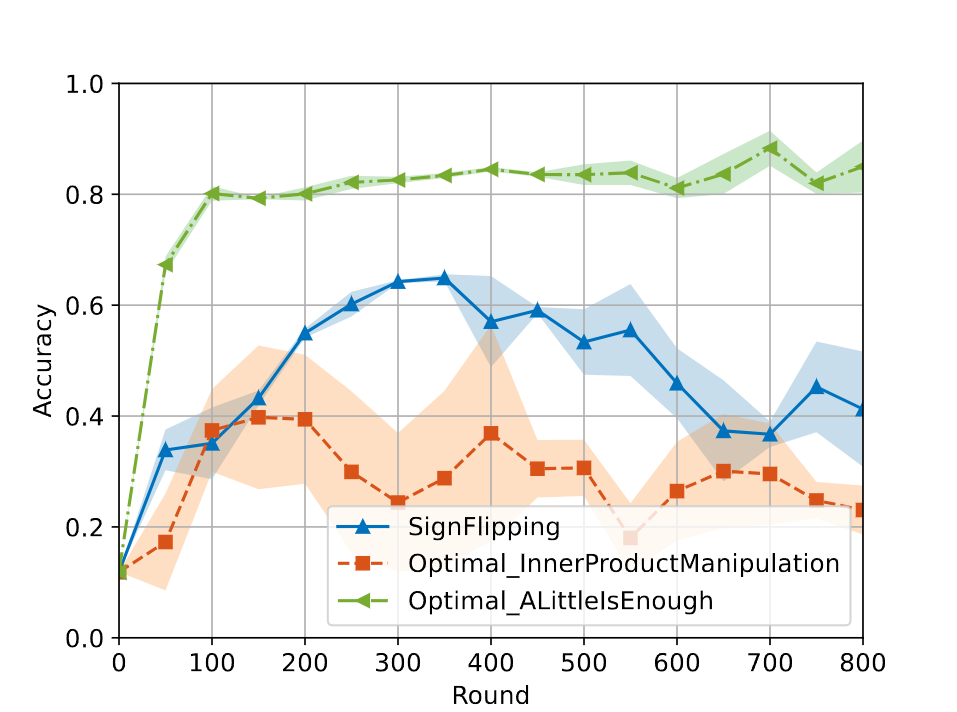
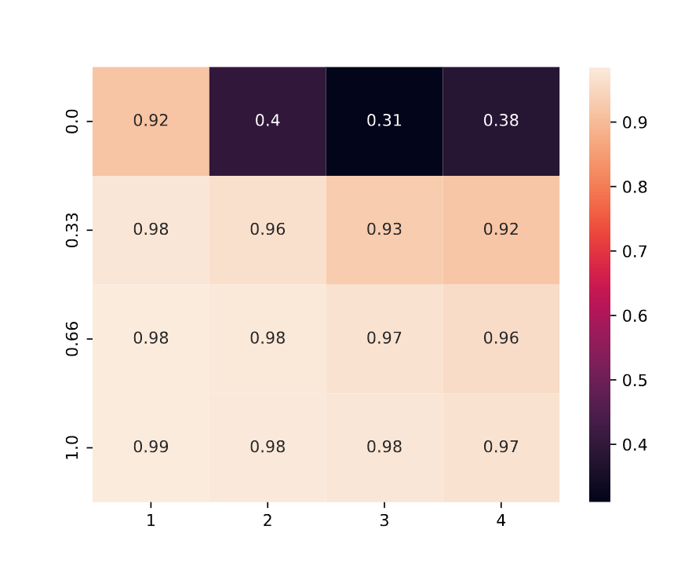

.. _federated_learning-label:

FL Benchmark
=========================

ByzFL includes a comprehensive benchmark for exhaustively testing federated learning aggregations.
This benchmark simulates a distributed environment configured via a JSON file, evaluates the 
performance of various settings, and provides convenient visualization tools.

Key Features
------------

- **Configurable Simulation**

  A single configuration file (``config.json``) allows you to define all parameters of the simulation, 
  including attack methods, models, and aggregation strategies.

- **Evaluation Protocol**

  Built-in routines analyze and compare results under various scenarios, automatically identifying the 
  best hyperparameters for each aggregation method in a worst-case attack environment.

- **Prebuilt Visualizations**

  Easily generate plots (accuracy curves, heatmaps, etc.) to quickly assess performance and compare 
  methods across different configurations.

Benchmark Pipeline
-------------------------

1. **Run All Configurations and Store Results**

   Execute all defined simulations (permutations of parameters) in parallel, saving results to a specified directory.

2. **Evaluate the Results**

   Identify the best configurations according to ByzFL’s evaluation protocol (described below).

3. **Generate Plots**

   Visualize the outcomes using prebuilt plotting functions.

Why This FL Benchmark?
-----------------------------

All modules in the Federated Learning Framework (as shown in the Federated Learning Simulation) 
allow you to set up and run a federated learning training process. However, the original 
framework does not focus on systematically testing a wide range of parameters. 
This Benchmark was created for precisely that purpose—leveraging the same modules but enabling 
exhaustive testing of aggregation methods, pre-aggregations, and attacks (existing or novel) 
across varying federated scenarios.

Examples of these scenarios include:

- Different numbers of honest vs. Byzantine nodes
- Various levels of data heterogeneity
- Multiple aggregation strategies

By simply editing the ``config.json`` file, you can fully customize the environment and run multiple 
experiments without changing the underlying code.

Set Up Your Experiments
------------------------
All experiments are conducted using a `config.json` file. This file must be placed in the same 
directory as the program that executes the benchmark. Below is the ``config.json`` 
configuration file used in the examples:

.. code-block:: json

    {
        "benchmark_config": {
            "device": "cuda",
            "training_seed": 0,
            "nb_training_seeds": 3,
            "nb_workers": 10,
            "nb_byz": [1, 2, 3, 4],
            "declared_nb_byz": [1, 2, 3, 4],
            "declared_equal_real": true,
            "fix_workers_as_honest": false,
            "size_train_set": 0.8,
            "data_distribution_seed": 0,
            "nb_data_distribution_seeds": 1,
            "data_distribution": [
                {
                    "name": "gamma_similarity_niid",
                    "distribution_parameter": [1.0, 0.66, 0.33, 0.0]
                }
            ]
        },
        "model": {
            "name": "cnn_mnist",
            "dataset_name": "mnist",
            "nb_labels": 10,
            "loss": "NLLLoss"
        },
        "aggregator": [
            {
                "name": "GeometricMedian",
                "parameters": {
                    "nu": 0.1,
                    "T": 3
                }
            },
            {
                "name": "TrMean",
                "parameters": {}
            }
        ],
        "pre_aggregators": [
            {
                "name": "Clipping",
                "parameters": {}
            },
            {
                "name": "NNM",
                "parameters": {}
            }
        ],
        "server": {
            "learning_rate": 0.1,
            "nb_steps": 800,
            "batch_norm_momentum": null,
            "batch_size_evaluation": 100,
            "learning_rate_decay": 1.0,
            "milestones": []
        },
        "honest_nodes": {
            "momentum": 0.9,
            "weight_decay": 0.0001,
            "batch_size": 25
        },
        "attack": [
            {
                "name": "SignFlipping",
                "parameters": {}
            },
            {
                "name": "Optimal_InnerProductManipulation",
                "parameters": {}
            },
            {
                "name": "Optimal_ALittleIsEnough",
                "parameters": {}
            }
        ],
        "evaluation_and_results": {
            "evaluation_delta": 50,
            "evaluate_on_test": true,
            "store_training_accuracy": true,
            "store_training_loss": true,
            "store_models": false,
            "data_folder": null,
            "results_directory": "./results"
        }
    }

Important Note
""""""""""""""

The `f` parameter must not be explicitly provided to aggregators, pre-aggregators, 
or attacks that require it, as it is already determined based on the values of 
"nb_byz" and "declared_nb_byz".

How to Launch the Benchmark
---------------------------

Use the code snippet below to start the benchmark:

.. code-block:: python

    from byzfl.benchmark import run_benchmark

    if __name__ == "__main__":  # Required for multiprocessing
        n = 1  # Number of training sessions to run in parallel
        run_benchmark(n)

``run_benchmark()`` reads the configuration from ``config.json`` and begins the benchmarking process. 
Results for each training session are saved in the folder specified by ``results_directory`` (default: ``./results``).

- **First-time use**: If no ``config.json`` file exists in your current directory, running ``run_benchmark()`` 
  creates a default configuration file. You can modify this file before re-running the benchmark.

- **Testing multiple parameter values**: You can specify a list of values for any supported parameter in 
  ``config.json``. Each entry in the list is treated as a separate simulation.

ByzFL provides a built-in evaluation function that identifies the best hyperparameters by considering 
worst-case attack scenarios. Specifically, it selects hyperparameters that yield the highest worst-case 
accuracy on a validation set while under the strongest attack (the one that minimizes maximum accuracy). 
This approach ensures robustness without overfitting to the test set.

Suported Variable Parameters
----------------------------

- Dataset
- Model
- Number of Workers
- Number of Byzantine
- Number of Declared Byzantine
- Data distribution name
- Data distribution parameters
- Aggregators (not their hyperparameters)
- Preaggregators (not their hyperparameters)
- Attacks (not their hyperparameters)
- Server Learning Rate
- Client Momentum
- Client Weight Decay

**Note**: Not all variables support lists. Using a list for an unsupported parameter may overwrite previous results.

How to View Results
-------------------

ByzFL offers several plotting functions to visualize benchmark outcomes.

Accuracy Curves
---------------

The function ``plot_accuracy_fix_agg_best_setting`` generates test accuracy curves for different attacks 
under a single aggregator/pre-aggregator setting. One plot is produced per configuration.

.. code-block:: python

    from byzfl.benchmark.evaluate_results import plot_accuracy_fix_agg_best_setting

    path_training_results = "./results"
    path_to_plot = "./plot"

    plot_accuracy_fix_agg_best_setting(
        path_training_results, 
        path_to_plot
    )

Example Plot
^^^^^^^^^^^^

For ``nb_byz=2``, ``declared_nb_byz=2``, ``distribution parameter = 0.0``, 
``aggregator = Trimmed Mean``, and ``pre-aggregators = Clipping + NNM``:

Heatmaps
--------

Heatmaps provide an overview of performance across multiple configurations on the same plot. The horizontal 
axis typically represents the number of Byzantine nodes, while the vertical axis denotes the distribution parameter. 
Each cell in the heatmap shows the worst-case performance under the strongest attack.

Heatmap of losses
^^^^^^^^^^^^^^^^^

.. code-block:: python

    from byzfl.benchmark.evaluate_results import heat_map_loss

    path_training_results = "./results"
    path_to_plot = "./plot"

    heat_map_loss(path_training_results, path_to_plot)

.. container:: image-row

    .. container:: image-column

        **Geometric Median (Loss)**

        .. image:: ../../_static/plots_example/GM_heatmap_loss.png
           :alt: Geometric Median Heatmap Loss
           :scale: 40%
           :align: center

    .. container:: image-column

        **Trimmed Mean (Loss)**

        .. image:: ../../_static/plots_example/TM_heatmap_loss.png
           :alt: Trimmed Mean Heatmap Loss
           :scale: 40%
           :align: center

Heatmap of test accuracy
^^^^^^^^^^^^^^^^^^^^^^^^

.. code-block:: python

    from byzfl.benchmark.evaluate_results import heat_map_test_accuracy

    path_training_results = "./results"
    path_to_plot = "./plot"

    heat_map_test_accuracy(path_training_results, path_to_plot)

.. container:: image-row

    .. container:: image-column

        **Geometric Median (Test Accuracy)**

        .. image:: ../../_static/plots_example/GM_test_heatmap.png
           :alt: Geometric Median Heatmap Test Accuracy
           :scale: 40%
           :align: center

    .. container:: image-column

        **Trimmed Mean (Test Accuracy)**

        .. image:: ../../_static/plots_example/TM_test_heatmap.png
           :alt: Trimmed Mean Heatmap Test Accuracy
           :scale: 40%
           :align: center

Aggregated heatmap of test accuracy
^^^^^^^^^^^^^^^^^^^^^^^^^^^^^^^^^^^

This plot consolidates all aggregator/pre-aggregator combinations, displaying only the best-performing 
approach in each region.

.. code-block:: python

    from byzfl.benchmark.evaluate_results import aggregated_heat_map_test_accuracy

    path_training_results = "./results"
    path_to_plot = "./plot"

    aggregated_heat_map_test_accuracy(
        path_training_results,
        path_to_plot
    )

Example
""""""" 

The aggregated view of Geometric Median and Trimmed Mean (both with Clipping + NNM) shows the best 
method for each configuration:

Running Custom Functions (Aggregators, Attacks, Models)
-------------------------------------------------------

You can easily extend ByzFL by adding custom aggregators, attacks, or models. You have two options:

1. Modify the code within the installed library.
2. Clone the ByzFL repository, make changes and run it:

.. code-block:: console

    git clone https://github.com/LPD-EPFL/byzfl.git

Adding an Aggregation or Preaggregation
^^^^^^^^^^^^^^^^^^^^^^^^^^^^^^^^^^^^^^^

To add a new aggregation or preaggregation, navigate to the ``byzfl`` folder and then enter the 
``aggregators`` directory. Inside, you will find the files ``aggregators.py`` and ``preaggregators.py``, 
where all existing aggregations and preaggregations are implemented as classes. Each class consists of 
two key methods:

- The constructor (``__init__``), where you define and initialize all required parameters for the aggregation.  
- The callable method (``__call__``), where you implement the logic of your aggregation to process the received vectors.

Example Implementation
"""""""""""""""""""""

Suppose that the **Geometric Median** aggregation is not yet implemented in the framework. In this case, 
you would need to create a new class implementing both the ``__init__`` and ``__call__`` methods, along 
with any necessary auxiliary methods.

.. code-block:: python

    class GeometricMedian:
        # Required
        def __init__(self, nu=0.1, T=3):
            if not isinstance(nu, float):
                raise TypeError("f must be a float")
            self.nu = nu
            if not isinstance(T, int) or T < 0:
                raise ValueError("T must be a non-negative integer")
            self.T = T

        # Required
        def __call__(self, vectors):
            tools, vectors = check_vectors_type(vectors)
            z = tools.zeros_like(vectors[0])

            filtered_vectors = vectors[~tools.any(tools.isinf(vectors), axis=1)]
            alpha = 1 / len(vectors)
            for _ in range(self.T):
                betas = tools.linalg.norm(filtered_vectors - z, axis=1)
                betas[betas < self.nu] = self.nu
                betas = (alpha / betas)[:, None]
                z = tools.sum((filtered_vectors * betas), axis=0) / tools.sum(betas)
            return z

Integration into the Framework
""""""""""""""""""""""""""""""

Once the new aggregation is implemented, add it to the ``aggregators.py`` file by copying and pasting 
it into the appropriate section.

Configuration in ``config.json``
""""""""""""""""""""""""""""""""

To use the newly added aggregation in the benchmarking process, update the ``config.json`` file 
accordingly. Ensure that:

- The ``"name"`` field in the configuration matches the name of your newly implemented function.
- The parameters specified in the configuration file correspond to the keys defined in the ``__init__`` 
  method of your class.

.. code-block:: json

    "aggregator": {
        "name": "GeometricMedian",
        "parameters": {
            "nu": 0.5,
            "T": 2
        }
    }

Important Note
""""""""""""""

If you want the framework to automatically set up the number of declared Byzantine nodes within your 
aggregation function, name the parameter **"f"** in the ``__init__`` method. Do not manually add it 
as a parameter, as it will be internally assigned through the ``declared_nb_byz`` parameter. However, 
it is essential that it remains named **"f"** in the constructor.

Adding an Attack
^^^^^^^^^^^^^^^^

The procedure for adding an attack follows the same steps as adding an aggregation or preaggregation. 
However, you have to add the class of your attack into ``byzfl/attacks/attacks.py``.

Implementation Details
"""""""""""""""""""""

To create a functional attack within the benchmark, you must implement both the ``__init__`` and ``__call__`` 
methods in the class:

- The ``__init__`` method should define and initialize all necessary parameters for the attack.
- The ``__call__`` method should implement the attack logic, modifying the input as required.

Configuration in ``config.json``
"""""""""""""""""""""""""""""""

The configuration process is identical to that of an aggregation, except that the attack should be 
specified under the **attack** key in the ``config.json`` file. Ensure that:

- The ``"name"`` field matches the name of the newly implemented attack.
- The parameters defined in the configuration file correspond to the ones specified in the ``__init__`` 
  method of your attack class.

Important Note
""""""""""""""

If you want the framework to automatically set up the number of Byzantine nodes within your attack, 
name the parameter **"f"** in the ``__init__`` method. Do not manually add it as a parameter, as it 
will be internally assigned through the ``nb_byz`` parameter. However, it is essential that it remains 
named **"f"** in the constructor.

Adding a new Model
^^^^^^^^^^^^^^^^^^

To add a new model, you must add the new class into ``byzfl/fed_framework/models.py``.

Implementation Details
"""""""""""""""""""""

To create a new model for benchmarking, you must inherit from ``nn.Module`` and implement the ``__init__`` 
and ``forward`` methods, following the standard approach for defining models in PyTorch.

- **Initialization (``__init__`` method)**:
  
  - Define the network architecture, including layers such as convolutional, fully connected, or recurrent layers, 
    depending on the model type.
  - Initialize all required parameters for the model.

- **Forward Propagation (``forward`` method)**:
  
  - Implement the forward pass, defining how input data flows through the layers.
  - Apply necessary activation functions, pooling operations, and transformations to obtain the final output.

Example:

.. code-block:: python

    class cnn_mnist(nn.Module):
        def __init__(self):
            """Initialize the model parameters."""
            super().__init__()
            self._c1 = nn.Conv2d(1, 20, 5, 1)
            self._c2 = nn.Conv2d(20, 50, 5, 1)
            self._f1 = nn.Linear(800, 500)
            self._f2 = nn.Linear(500, 10)

        def forward(self, x):
            """Perform a forward pass through the model."""
            x = F.relu(self._c1(x))
            x = F.max_pool2d(x, 2, 2)
            x = F.relu(self._c2(x))
            x = F.max_pool2d(x, 2, 2)
            x = F.relu(self._f1(x.view(-1, 800)))
            x = F.log_softmax(self._f2(x), dim=1)
            return x

Configuration in ``config.json``
"""""""""""""""""""""""""""""""

Once the model is added to the corresponding file, you only need to specify its name in the model name 
field of the ``config.json`` file. This ensures that the benchmarking framework correctly identifies 
and utilizes the newly implemented model during evaluation.

.. code-block:: json

    "model": {
        "name": "cnn_mnist"
    }